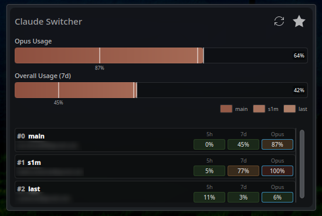

# C2Switcher

> Manage multiple Claude Code accounts with usage tracking, load balancing, and a KDE Plasma widget

C2Switcher is a practical CLI tool for juggling multiple Claude Code accounts. It tracks usage, automatically selects the best account based on availability, and includes a neat Plasma widget for at-a-glance monitoring.

## Features

<div align="center">



_Live usage monitoring with color-coded badges and one-click account switching_

</div>

- **Multi-account management** - Store and switch between multiple Claude Code accounts
- **Usage tracking** - Monitor 5-hour, 7-day, and Opus usage limits with color-coded indicators
- **Smart load balancing** - Automatically picks the optimal account based on usage and active sessions
- **Session tracking** - See which accounts are actively being used and where
- **KDE Plasma widget** - Monitor all accounts from your panel
- **Usage caching** - Respects rate limits with 30-second cache
- **Wrapper script** - `c2claude` command for seamless account switching

## Disclaimer

_This tool uses undocumented OAuth API endpoints to fetch usage data. While Anthropic allows users to create multiple accounts (confirmed by multiple people who asked Anthropic Staff, including me), this specific implementation relies on reverse-engineered API paths that may change without notice._

_If Anthropic would prefer this tool not exist, please reach out and I'll gladly take it down. I'm very compliant like that :)_

## Quick Start

### One-line Installation

```bash
curl -fsSL https://raw.githubusercontent.com/can1357/c2switcher/master/setup.sh | bash
```

Or download and run interactively:

```bash
git clone https://github.com/can1357/c2switcher.git
cd c2switcher
./setup.sh
```

The interactive installer will ask what you want to install:

- CLI tools only
- CLI tools + KDE Plasmoid
- Plasmoid only (if CLI already installed)

### Alternative: Manual Installation

```bash
# Install Python package
pip install -e .

# Or use setup.sh with options
./setup.sh --cli        # CLI tools only
./setup.sh --plasmoid   # Plasmoid only (requires CLI)
./setup.sh --all        # Install everything
```

## Usage

### Adding Accounts

Add your current account (from `~/.claude/.credentials.json`):

```bash
c2switcher add
```

Add with a memorable nickname:

```bash
c2switcher add --nickname work
```

Add from a specific credentials file:

```bash
c2switcher add --creds-file ~/path/to/credentials.json --nickname personal
```

### Viewing Accounts

```bash
$ c2switcher ls
```

Output:

```
                              Claude Code Accounts
╭───────┬──────────┬────────────────────┬───────────┬──────┬───────────────────╮
│ Index │ Nickname │ Email              │ Name      │ Type │ Tier              │
├───────┼──────────┼────────────────────┼───────────┼──────┼───────────────────┤
│   0   │ main     │ ****@gmail.com     │ ****      │ Max  │ default_claude... │
│   1   │ work     │ ****@gmail.com     │ ****      │ Max  │ default_claude... │
│   2   │ personal │ ****@gmail.com     │ ****      │ Max  │ default_claude... │
╰───────┴──────────┴────────────────────┴───────────┴──────┴───────────────────╯
```

### Checking Usage

```bash
$ c2switcher usage
```

Output:

```
                             Usage Across Accounts
╭───────┬──────────┬────────────────────┬─────┬─────┬─────────┬──────────╮
│ Index │ Nickname │ Email              │  5h │  7d │ 7d Opus │ Sessions │
├───────┼──────────┼────────────────────┼─────┼─────┼─────────┼──────────┤
│   0   │ main     │ ****@gmail.com     │  0% │ 45% │     87% │    0     │
│   1   │ work     │ ****@gmail.com     │  5% │ 77% │    100% │    0     │
│   2   │ personal │ ****@gmail.com     │ 11% │  3% │      6% │    1     │
╰───────┴──────────┴────────────────────┴─────┴─────┴─────────┴──────────╯

Active Sessions (1):
  * ****@gmail.com (/home/user/projects/myproject, 4m ago)
```

Color indicators:

- 🟢 **Green** (< 70%) - Plenty of headroom
- 🟡 **Yellow** (70-90%) - Getting close
- 🔴 **Red** (> 90%) - Nearly exhausted

Force refresh (ignore 30s cache):

```bash
c2switcher usage --force
```

JSON output for scripting:

```bash
c2switcher usage --json
```

### Switching Accounts

Switch by index:

```bash
c2switcher switch 0
```

Switch by nickname:

```bash
c2switcher switch work
```

Switch by email:

```bash
c2switcher switch user@example.com
```

### Finding the Optimal Account

```bash
c2switcher optimal
```

This shows the best account based on:

1. **Tier 1**: Opus usage < 90% (prioritized)
2. **Tier 2**: Opus exhausted but overall usage < 90%
3. **Load balancing**: Considers active and recent sessions

Switch to the optimal account:

```bash
c2switcher optimal --switch
```

### Cycling Through Accounts

Rotate to the next account in your list:

```bash
c2switcher cycle
```

Useful for quick manual rotation without looking up indices.

## The `c2claude` Wrapper

The wrapper combines account selection with running Claude Code:

```bash
# Use optimal account (default)
c2claude

# Use account 0
c2claude -1

# Use account 1
c2claude -2

# Use account by name/email/index
c2claude -a work

# Cycle to next account
c2claude --cycle

# Pass arguments to claude
c2claude -p "explain this code"
c2claude --model opus -p "complex task"
```

The wrapper handles:

- Session registration and tracking
- Load balancing (even for short commands)
- Account stickiness (reuses the same account for a session)
- Cleanup on exit

## KDE Plasma Widget

### Features

- **Compact panel view**: Shows average Opus usage with color-coded badge
- **Detailed popup**: Combined usage bar + individual account cards
- **Quick switching**: One-click optimal account selection
- **Auto-refresh**: Polls every 60 seconds
- **No services needed**: Directly executes `c2switcher` commands

### Installation

```bash
./setup.sh --plasmoid
```

Or manually:

```bash
kpackagetool6 --type=Plasma/Applet --install plasmoid
```

### Adding to Panel

1. Right-click panel -> "Add Widgets..."
2. Search for "Claude Code Usage"
3. Drag to panel

## Command Reference

### Core Commands

| Command    | Aliases                 | Description                          |
| ---------- | ----------------------- | ------------------------------------ |
| `add`      |                         | Add a new account                    |
| `ls`       | `list`, `list-accounts` | List all accounts                    |
| `usage`    |                         | Show usage across accounts           |
| `optimal`  | `pick`                  | Find optimal account                 |
| `switch`   | `use`                   | Switch to specific account           |
| `cycle`    |                         | Rotate to next account               |
| `sessions` |                         | List active sessions                 |
| `history`  | `session-history`       | Show past sessions with usage deltas |

### Session Commands

These are typically called by `c2claude`, not manually:

| Command         | Description                   |
| --------------- | ----------------------------- |
| `start-session` | Register a new Claude session |
| `end-session`   | Mark a session as ended       |

### Global Options

All commands support:

- `--json` - Output as JSON (where applicable)
- `--help` - Show command help

## How It Works

### Database

All data is stored in `~/.c2switcher/store.db` (SQLite):

- Account credentials and metadata
- Usage history with timestamps
- Session tracking (PID, working directory, duration)

### Token Refresh

When a token expires, c2switcher automatically refreshes it:

1. First tries: `claude -p /status --verbose --output-format=json` (no usage)
2. Falls back to: `claude -p hi --model haiku` if needed

This ensures tokens stay valid with minimal to no usage consumption.

**Sandboxed Refresh**: Token refresh operations run in an isolated temporary HOME directory (`~/.c2switcher/tmp/{account_uuid}`) to avoid interfering with any running Claude Code instances. User preferences (terminal theme, settings) are inherited from the real HOME to prevent prompts. The sandbox is automatically cleaned up after each refresh.

If refresh fails (e.g., revoked or invalid credentials), you'll see:

```
Error: Failed to refresh token. The credentials may be revoked or invalid.
Please re-authenticate by logging in to Claude Code with this account.
```

### Usage Caching

API calls are cached for 30 seconds to avoid rate limiting. Use `--force` to bypass.

### Load Balancing

The optimal account selection uses a scoring system:

```
score = base_usage + (active_sessions × 15) + (recent_sessions × 5)
```

Where:

- `base_usage` = Opus usage (tier 1) or overall usage (tier 2)
- `active_sessions` = currently running Claude instances
- `recent_sessions` = sessions started in last 5 minutes

### Session Tracking

Each `c2claude` invocation:

1. Registers a session (PID, working directory)
2. Requests optimal account (with session ID for stickiness)
3. Switches to the selected account
4. Runs Claude
5. Marks session as ended on exit

Dead sessions are automatically cleaned up using multi-factor liveness checks.

## Environment Variables

| Variable           | Description                          |
| ------------------ | ------------------------------------ |
| `DEBUG_SESSIONS=1` | Enable verbose session tracking logs |

## Files and Paths

| Path                             | Purpose                                        |
| -------------------------------- | ---------------------------------------------- |
| `~/.c2switcher/store.db`         | SQLite database (accounts, usage, sessions)    |
| `~/.c2switcher/tmp/{uuid}/`      | Sandboxed temp directories for token refresh   |
| `~/.claude/.credentials.json`    | Active Claude Code credentials                 |
| `/usr/local/bin/c2switcher`      | CLI tool                                       |
| `/usr/local/bin/c2claude`        | Wrapper script                                 |

## Uninstallation

```bash
./setup.sh --uninstall
```

Or manually:

```bash
# Automatic uninstall
./setup.sh --uninstall

# Or manually:
# Remove CLI tools
sudo rm /usr/local/bin/c2switcher /usr/local/bin/c2claude

# Remove plasmoid
kpackagetool6 --type=Plasma/Applet --remove org.claudecode.usage.plasma

# Remove all c2switcher data (optional)
rm -rf ~/.c2switcher/
```

## Examples

### Typical Workflow

```bash
# Add your accounts (switch credentials in Claude Code first, then add)
c2switcher add --nickname main
c2switcher add --nickname work
c2switcher add --nickname personal

# Check usage
c2switcher usage

# Use optimal account automatically
c2claude

# Or manually pick one
c2claude -a work

# Check session history
c2switcher history
```

### Scripting

```bash
# Get JSON output for parsing
optimal=$(c2switcher optimal --json)
email=$(echo "$optimal" | jq -r '.email')
echo "Best account: $email"

# Check if any account has Opus available
c2switcher usage --json | jq '.[] | select(.usage.seven_day_opus.utilization < 90)'
```

### Quick Account Rotation

```bash
# Try each account until one works
for i in {0..2}; do
    c2switcher switch $i
    claude -p "test" && break
done
```

## Requirements

- **Python** 3.7+
- **Claude Code** CLI installed and configured
- **KDE Plasma** 6.0+ (for plasmoid only)

### Python Dependencies

- `click` >= 8.1.0
- `rich` >= 13.0.0
- `requests` >= 2.31.0
- `psutil` >= 5.9.0

Installed automatically via `requirements.txt`.

## Troubleshooting

### "c2switcher: command not found"

Ensure `/usr/local/bin` is in your PATH:

```bash
export PATH="/usr/local/bin:$PATH"
```

Add to `~/.bashrc` or `~/.zshrc` to make permanent.

### Token refresh fails

If you see "Failed to refresh token. The credentials may be revoked or invalid":

1. Log in to Claude Code with that account to generate fresh credentials
2. Re-add the account to c2switcher:
   ```bash
   c2switcher add --nickname <name>
   ```

Make sure the `claude` command works:

```bash
claude -p hi --model haiku
```

### Plasmoid shows errors

Verify c2switcher works from terminal:

```bash
c2switcher usage --json
```

Check plasmoid logs:

```bash
journalctl -f | grep plasmashell
```

### Plasmoid not updating after upgrade

Restart plasmashell to reload the widget:

```bash
systemctl --user restart plasma-plasmashell
```

Or remove and re-add the widget to your panel.

### Sessions not tracked properly

Dead sessions should auto-cleanup, but you can manually verify:

```bash
c2switcher sessions
```

Enable debug mode:

```bash
DEBUG_SESSIONS=1 c2claude
```

## Contributing

Improvements are welcome:

1. Fork it
2. Create a feature branch
3. Submit a PR

## Credits

Built for personal use, released in case others find it useful. Not affiliated with Anthropic.

---

**Tip**: Bind `c2claude` to a shell alias or keyboard shortcut for maximum laziness.
